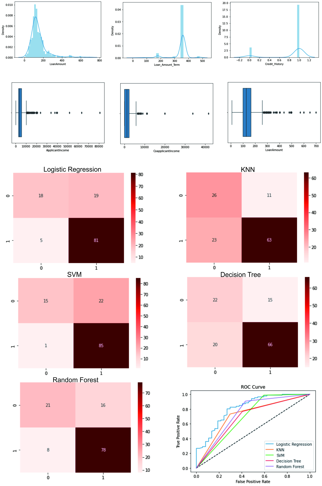
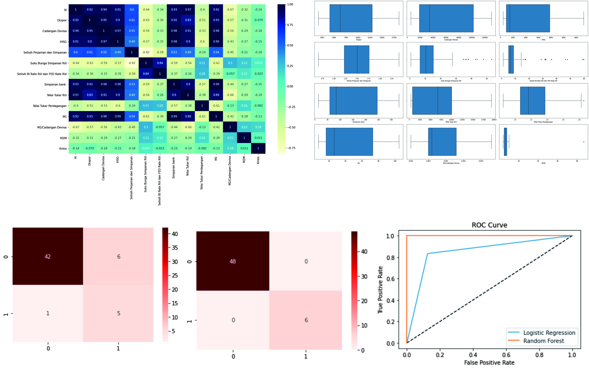
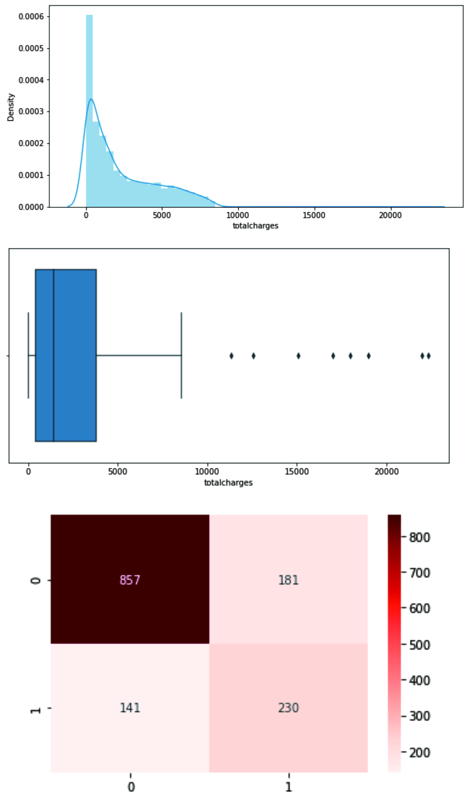

# Portfolio

---

## Clustering Universities in America

### Project Overview

The project aims to group universities in America. To group them, I do clustering.
I am performing comprehensive EDA on the Universities in America dataset, then transform the data using Principal
Component Analysis to clustering universities.
  
I will predict the number of clusters of universities in America

---

## Loan Approval Prediction

### Project Overview

This project to determine the loan approval based on personal information and loan history. I am performing comprehensive EDA on the Loan Approval Prediction dataset to understand important variables, handled missing values, outliers, and ensemble machine learning models to predict the Applicant's loan approval. The best model for this project is logistic regression.
  
I will predict whether the loan can be approved or not and compare it to the actual status of the loan.

---

## Indonesia Financial Crisis

### Project Overview

The project to determine whether or not the company experiencing a crisis based on its important features. 
I am performing comprehensive EDA on Indonesia’s financial crisis dataset to understand important variables,
outliers, and ensemble machine learning models to predict new data to find out which data are in crisis. The 
best model for this project is the random forest using ROC/AUC as evaluation matrix.
I will predict the number of clusters of universities in America.

---

## Predict Churned Customer

### Project Overview

The project to determine the churned customer based on its important features so the company can give them special treatment. 
I am performing comprehensive EDA on Churned Customer dataset to understand important variables, handled missing values,
outliers, and ensemble machine learning models to predict the churned customers. The model for this project is logistic regression.
I will predict the churned customers.
  

  
---  

---

---

---

Page template forked from <a href="https://github.com/evanca/quick-portfolio">evanca</a>

<!-- Remove above link if you don't want to attibute -->
